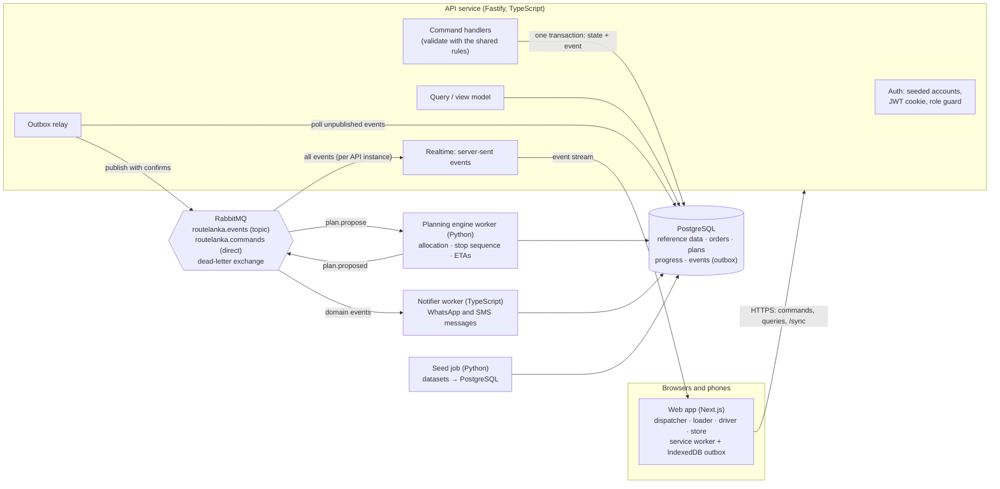

# RouteLanka architecture

RouteLanka is one system used by four roles. Every role reads and writes one shared record, and
every change is published as a domain event so the other roles hear about it straight away. This is
the "relay" from the Designathon design, implemented as an event-driven service architecture.

## Components

| Component | Responsibility | Why it is separate |
|---|---|---|
| **Web app** (`apps/web`) | The screens from the Designathon design, for all four roles. Works offline on the driver's phone. | UI only; holds no business state of its own. |
| **API service** (`apps/api`) | Sign-in, role checks, every command (publish, load, deliver, …) and every query. Writes state and the matching event in one transaction. | The single place that enforces the operating rules and owns the database. |
| **Planning engine** (`services/engine`) | Proposes the allocation: orders → vehicles and trips, deferrals with reasons, stop order, predicted arrival. | CPU-bound and written in Python (the same engine validated with the organisers' `check_allocation.py`). Runs as a queue worker so a slow plan never blocks the API. |
| **Notifier** (`services/notifier`) | Turns domain events into store messages (WhatsApp) and driver SMS, in each person's language. | Messaging is a side effect. If it is slow or down, planning and delivery keep working; messages catch up. |
| **Seed job** (`services/engine`, `seed` command) | Loads the shared datasets and one realistic delivery day on a fresh install. | Runs once at start-up, then exits. |
| **PostgreSQL** | The shared record. | |
| **RabbitMQ** | Carries commands to workers and fans events out to every consumer. | Decouples the roles: the loader's flag reaches the dispatcher, the notifier and every open screen without the API calling each of them. |

## How a decision travels (example: the loader flags missing crates)

1. The loader's tablet sends `POST /api/commands {type: "loadFlag"}`.
2. The API checks the role and the rules, then in **one database transaction** updates the order's
   progress and appends `load.flagged` to the `events` table (the transactional outbox).
3. The outbox relay publishes the event to the `routelanka.events` exchange with publisher confirms,
   then marks it published. If RabbitMQ is down, events wait in the table and nothing is lost.
4. RabbitMQ routes a copy to every bound queue:
   - each API instance's realtime queue → server-sent event → the dispatcher's screen refreshes and
     the decision card appears;
   - the notifier queue → nothing to send yet (the store is told once the dispatcher decides).
5. The dispatcher chooses "send short" → `load.decided` → the notifier writes the store's WhatsApp
   message; the loader and driver screens update.

## Reliability rules

| Rule | Implementation |
|---|---|
| No lost events | Transactional outbox: state and event are committed together; the relay retries until RabbitMQ confirms. |
| No duplicate effects | Every event has a UUID. Consumers record processed IDs (`processed_messages`) and skip repeats. Field records from phones carry their own UUID, so a re-sent sync is stored once. |
| Poison messages don't block a queue | Failed messages are retried, then routed to a dead-letter queue for inspection. |
| Field facts win | A delivery recorded on the phone is never overwritten by a later plan change; the dispatcher is told instead. |
| Offline driver | The run is cached on the phone at release. Records go to an IndexedDB outbox and sync to `POST /api/sync` when connectivity returns, keeping the time they were recorded. |

## Demo days (isolation for judges)

Reference data (outlets, vehicles, districts, calendar) is shared. Everything that changes during a
walkthrough belongs to a **demo day** (`workspaces` table). The seeded demo day is Friday
24 April 2026. "Start the night again" on the sign-in page creates a fresh demo day for that browser,
so two judges using the deployed URL at the same time don't change each other's plan.
