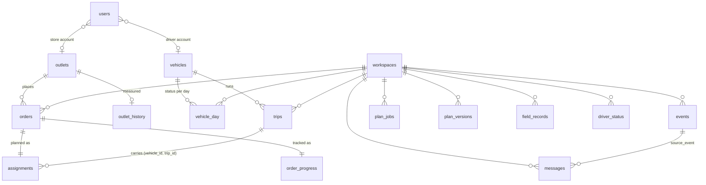

# RouteLanka data model

PostgreSQL 16. The schema lives in `db/migrations/` and is applied in order by `services/engine/routelanka_engine/migrate.py`,
which takes an advisory lock and records each file in `schema_migrations`.

There are three kinds of table:

* **Reference data:** loaded once from the competition datasets and shared by every demo day.
* **Day data:** one delivery night, keyed by `workspace_id`. A judge pressing *New demo day* gets a fresh copy, so
  several people can run the walkthrough at once without disturbing each other.
* **Messaging and audit:** the event log (which is also the transactional outbox), store messages, and consumer bookkeeping.

## Reference data (from the datasets)

| Table | Key | Contents |
|---|---|---|
| `outlets` | `outlet_id` | brand, district, depot, dock type, parking constraint, mall window, delivery window |
| `vehicles` | `vehicle_id` | type, temperature, weight and volume capacity, km/l, weekly fuel quota, home depot |
| `districts` | `district` | depot, road class, depot-to-district and inter-stop km and free-flow minutes |
| `service_allowance` | `brand, dock_type` | the dispatcher's handling allowance per stop |
| `calendar` | `date` | weekday, ISO week, payday, festival and ramp, holiday, monsoon, operating day |
| `road_conditions` | `district, date` | disruption index |
| `outlet_history` | `outlet_id` | the outlet's recent delivery record, measured from the route records at seed time (JSON summary) |
| `capacity_outlook` | `depot, iso_year, iso_week` | weekly total and chilled demand against chilled capacity, with operating days, festival and paydays (the *Outlook* screen) |
| `engine_params` | `key` | parameters for the engine's predictions (service time, traffic, lateness), measured from the history at seed time (JSON) |

## Accounts

| Table | Key | Contents |
|---|---|---|
| `users` | `id`, unique `username` | bcrypt password hash, role (`dispatcher`, `loader`, `driver`, `store`), display name, language (`en`, `si`, `ta`: it follows the person, on every device and demo day), and the role's scope: depot, `outlet_id` or `vehicle_id` + `trip_id` |

## Day data (per `workspace_id`)

| Table | Key | Contents |
|---|---|---|
| `workspaces` | `id` | one demo day: name, service date, demo clock (`clock_start`, `clock_speed`), `published`, `plan_version`, `meta` (personas). One row is the template (`is_template`), one is the default (`is_default`) |
| `vehicle_day` | `workspace_id, vehicle_id` | status that day (available / in workshop), fuel used this week |
| `orders` | `workspace_id, order_ref` | the order: outlet, brand, temperature, units, kg, m³, run date, whether skipped yesterday, days since last served |
| `assignments` | `workspace_id, order_ref` | the plan: served/deferred, reason code, vehicle, trip, stop sequence, planned and predicted arrival, predicted service minutes and late probability, priority |
| `trips` | `workspace_id, vehicle_id, trip_id` | brand, district, departure, minutes, km, fuel, `ready_at`, `departed_at` |
| `order_progress` | `workspace_id, order_ref` | the night as it happens: stage, loader flag and decision, handover code, arrival, delivery, units, proof of delivery, offline flag, sync time, store receipt, reassignment, delay choice, store reply |
| `driver_status` | `workspace_id, vehicle_id` | online or not, last report, delay report, last sync result, conflicts |
| `field_records` | `id` (client UUID) | every record the driver's phone sent, so replaying a sync is harmless (idempotent) |
| `plan_versions` | `workspace_id, version` | snapshot of each published plan |
| `plan_jobs` | `id` | planning requests to the engine: status, `dispatched_at`, summary, error |
| `fleet_actions` | `id` | repair and hire decisions from the *Fleet* screen |

## Messaging and audit

| Table | Key | Contents |
|---|---|---|
| `events` | `id`, ordered by `seq` | **every** state change: `type` (e.g. `load.flagged`), actor role, order, text for the feed, `payload`, demo time, `in_feed`, `open` (needs a decision). Written in the same transaction as the change. `published_at` is set once the relay has confirmed it with RabbitMQ (transactional outbox). An insert trigger sends `pg_notify('outbox')` so the relay wakes at once |
| `messages` | `id`, unique `(source_event, order_ref, template)` | store WhatsApp and driver SMS messages written by the notifier: an English template (also the translation key) plus values and reply buttons. The unique key makes a redelivered event harmless. It is also the WhatsApp outbox: `wa_status` (pending → sent → delivered → read, or failed/skipped), `wa_id`, attempts and errors |
| `outlet_contacts` | `outlet_id` | each outlet's WhatsApp number, whether it's a live number, opt-in time, and the store's last message (opens the 24-hour window) |
| `wa_log` | `id` | every WhatsApp Cloud API request and webhook, as sent and received, with HTTP status and signature result (never the token) |
| `wa_inbound` | `wamid` | incoming WhatsApp messages already applied (Meta retries webhooks) |
| `processed_messages` | `consumer, event_id` | which consumer has handled which event or job, so at-least-once delivery from RabbitMQ never applies anything twice |

## Rules the schema enforces

* Foreign keys tie every order, plan row and progress row to its day; deleting a day cascades.
* Composite primary keys keep a stop on exactly one plan row and one progress row.
* Partial unique indexes allow only one template day and one default day.
* Operating rules (capacity, trip time, reefer, van-only, two trips, home depot) are checked in code before any
  write: in `packages/domain/src/rules.ts` for the API and web app, and in `services/engine` for the engine. The same
  rules are unit-tested against the booklet's worked examples, and the engine is also tested with `check_allocation.py`.
