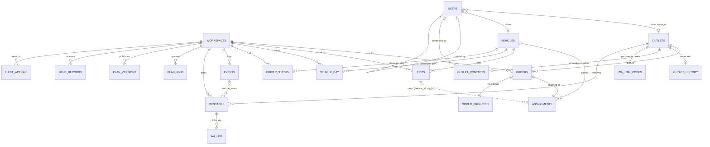
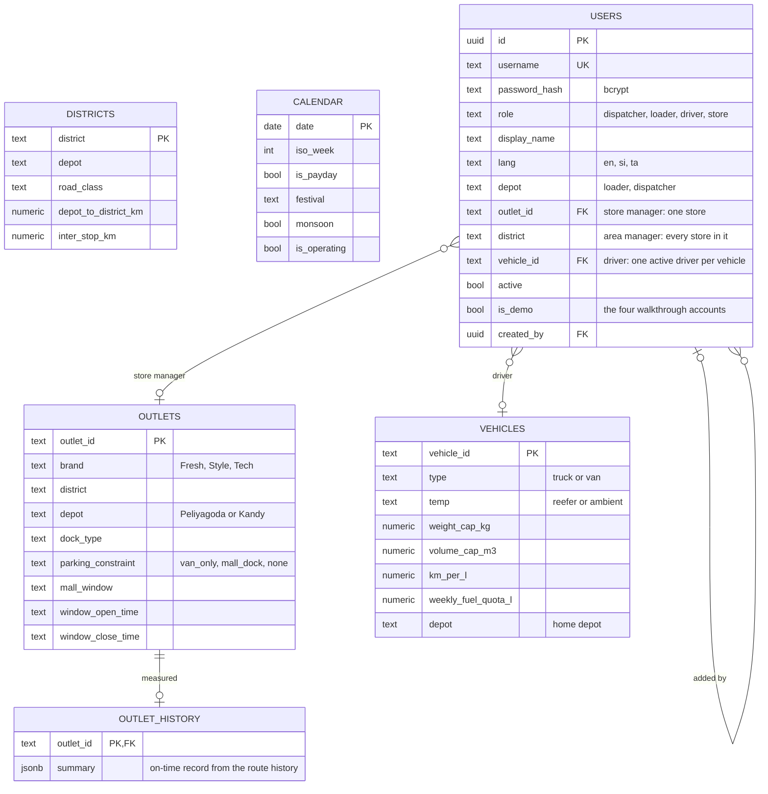
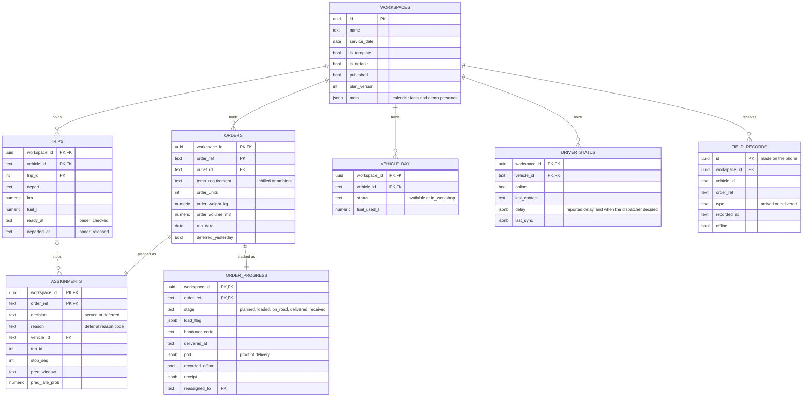
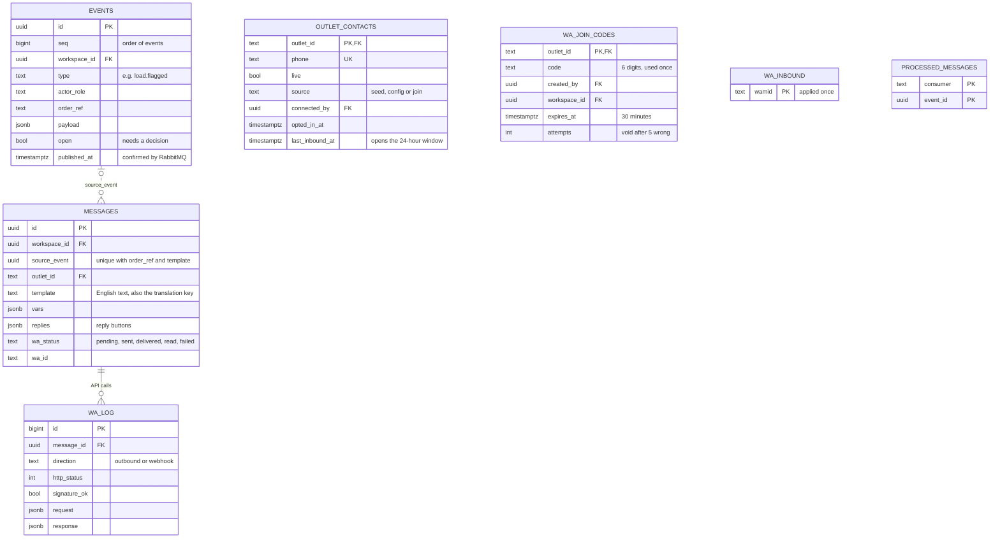

# RouteLanka data model

PostgreSQL 16. The schema lives in `db/migrations/` (001 to 008) and is applied in order by
`services/engine/routelanka_engine/migrate.py`, which takes an advisory lock and records each file in
`schema_migrations`.

There are four groups of table:

* **Reference data:** loaded once from the competition datasets and shared by every demo day.
* **People and access:** staff accounts, each tied to the work it covers.
* **Day data:** one delivery night, keyed by `workspace_id`. A judge pressing *Start a new demo day* gets a fresh
  copy, so several people can run the walkthrough at once without disturbing each other.
* **Messaging and audit:** the event log (which is also the transactional outbox), store messages, WhatsApp, and
  consumer bookkeeping.

The diagrams below are also exported as images in [`diagrams/`](diagrams/) for viewers that don't render Mermaid.

## Entity relationship overview

Solid lines are foreign keys in the database. Dotted lines are links the application keeps (by matching columns)
without a foreign key: a trip is identified by `(workspace_id, vehicle_id, trip_id)` and a message by the event
that caused it.

## Reference data and people

## One delivery night (day data)

## Messaging, WhatsApp and audit

## Tables

### Reference data (from the datasets)

| Table | Key | Contents |
|---|---|---|
| `outlets` | `outlet_id` | brand, district, depot, dock type, parking constraint, mall window, delivery window |
| `vehicles` | `vehicle_id` | type, temperature, weight and volume capacity, km/l, weekly fuel quota, home depot |
| `districts` | `district` | depot, road class, depot-to-district and inter-stop km and free-flow minutes |
| `service_allowance` | `brand, dock_type` | the dispatcher's handling allowance per stop |
| `calendar` | `date` | weekday, ISO week, payday, festival and ramp, holiday, monsoon, operating day |
| `road_conditions` | `district, date` | disruption index |
| `outlet_history` | `outlet_id` | the outlet's recent delivery record, measured from the route records at seed time (JSON summary) |
| `capacity_outlook` | `depot, iso_year, iso_week` | weekly total and chilled demand against chilled capacity, with operating days, festival and paydays (the *Capacity outlook* screen) |
| `engine_params` | `key` | parameters for the engine's predictions (service time, traffic, lateness), measured from the history at seed time (JSON) |

### People and access

| Table | Key | Contents |
|---|---|---|
| `users` | `id`, unique `username` | bcrypt password hash, role, display name, language (it follows the person, on every device and demo day), `active`, `is_demo`, who added them, and the work the account covers: a **depot** (loader, dispatcher), a **store** (`outlet_id`) or every store in a **district** (area manager), or a **vehicle** (driver). A check constraint requires a store or district for store managers and a vehicle for drivers; a partial unique index allows one active driver per vehicle |

The API reloads the account on every request, so a deactivated account or a changed scope applies at once.

### Day data (per `workspace_id`)

| Table | Key | Contents |
|---|---|---|
| `workspaces` | `id` | one demo day: name, service date, demo clock (`clock_start`, `clock_speed`), `published`, `plan_version`, `meta`. One row is the template (`is_template`), one is the default (`is_default`) |
| `vehicle_day` | `workspace_id, vehicle_id` | status that day (available / in workshop), fuel used this week |
| `orders` | `workspace_id, order_ref` | the order: outlet, brand, temperature, units, kg, m³, run date, whether skipped yesterday, days since last served |
| `assignments` | `workspace_id, order_ref` | the plan: served/deferred, reason code, vehicle, trip, stop sequence, planned and predicted arrival, predicted service minutes and late probability, priority |
| `trips` | `workspace_id, vehicle_id, trip_id` | brand, district, departure, minutes, km, fuel, `ready_at` (loaded and checked), `departed_at` (released by the loader) |
| `order_progress` | `workspace_id, order_ref` | the night as it happens: stage, loader flag and decision, handover code, arrival, delivery, units, proof of delivery, offline flag, sync time, store receipt, reassignment, delay choice, store reply |
| `driver_status` | `workspace_id, vehicle_id` | one row per vehicle with a driver's phone: online or not, last report, delay report (and when the dispatcher decided it), last sync result, conflicts |
| `field_records` | `id` (client UUID) | every record a driver's phone sent, so replaying a sync is harmless (idempotent) |
| `plan_versions` | `workspace_id, version` | snapshot of each published plan |
| `plan_jobs` | `id` | planning requests to the engine: status, `dispatched_at`, summary, error |
| `fleet_actions` | `id` | repair and hire decisions from the *Fleet* screen |

### Messaging and audit

| Table | Key | Contents |
|---|---|---|
| `events` | `id`, ordered by `seq` | **every** state change: `type` (e.g. `load.flagged`), actor role, order, text for the feed, `payload`, demo time, `in_feed`, `open` (needs a decision). Written in the same transaction as the change. `published_at` is set once the relay has confirmed it with RabbitMQ (transactional outbox). An insert trigger sends `pg_notify('outbox')` so the relay wakes at once |
| `messages` | `id`, unique `(source_event, order_ref, template)` | store WhatsApp and driver SMS messages: an English template (also the translation key) plus values and reply buttons. The unique key makes a redelivered event harmless. It is also the WhatsApp outbox: `wa_status` (pending → sent → delivered → read, or failed/skipped), `wa_id`, attempts and errors |
| `outlet_contacts` | `outlet_id`, unique `phone` | each outlet's WhatsApp number; how it was linked (`seed` demo number, `config` from `WHATSAPP_LIVE_NUMBERS`, or `join` from the store's own phone) and by whom; opt-in time; the store's last message (opens the 24-hour window) |
| `wa_join_codes` | `outlet_id` | the store's open *Connect WhatsApp* code: 6 digits, the demo day it was asked in, expiry (30 minutes), wrong attempts (void after 5) |
| `wa_log` | `id` | every WhatsApp Cloud API request and webhook, as sent and received, with HTTP status and signature result (never the token) |
| `wa_inbound` | `wamid` | incoming WhatsApp messages already applied (Meta retries webhooks) |
| `processed_messages` | `consumer, event_id` | which consumer has handled which event or job, so at-least-once delivery from RabbitMQ never applies anything twice |

## Rules the schema enforces

* Foreign keys tie every order, plan row and progress row to its day; deleting a day cascades.
* Composite primary keys keep a stop on exactly one plan row and one progress row.
* Partial unique indexes allow only one template day, one default day, and one active driver per vehicle.
* A check constraint ties each store manager to a store or a district, and each driver to a vehicle.
* Operating rules (capacity, trip time, reefer, van-only, two trips, home depot, fuel quota) are checked in code
  before any write: in `packages/domain/src/rules.ts` for the API and web app, and in `services/engine` for the
  engine. The same rules are unit-tested against the booklet's worked examples, and the engine is also tested with
  `check_allocation.py`.
* The flow order is checked in code too: a trip is marked ready only when every order is loaded, and a driver can
  record an arrival or delivery only after the loader has released the truck.
