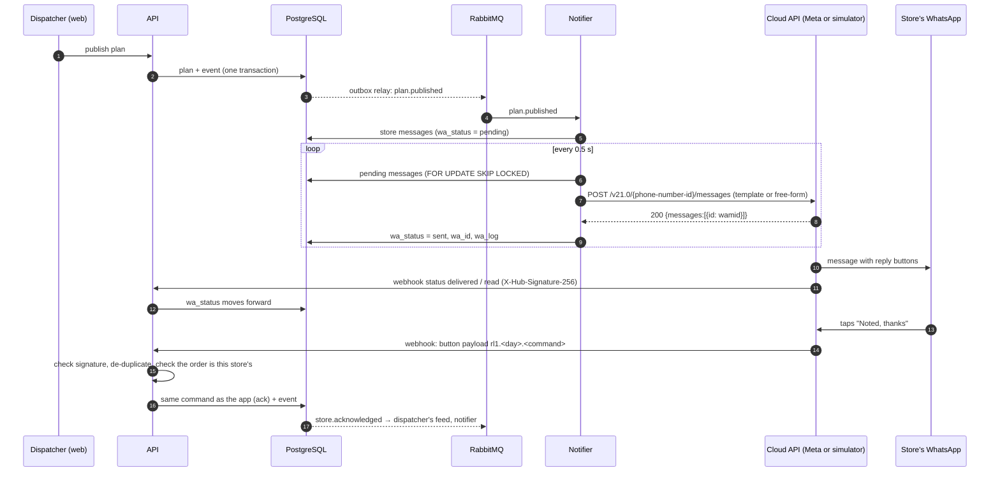

# WhatsApp integration

Store managers get RouteLanka's updates on WhatsApp: arrival windows, deferrals, short shipments, handover codes,
delays and delivery confirmations. They reply with one tap. RouteLanka talks to the **WhatsApp Business Platform
(Cloud API)**, Meta's official API, and the replies come back to the same command handlers, rules and events as a
tap in the app.

Judges can't be given a Meta account and a phone for every store, so the stack includes a **Cloud API simulator**
that speaks the same wire protocol as Meta: the same send endpoint and answers, and webhooks signed with the app
secret. RouteLanka can't tell the two apart. Switching to Meta is configuration only.

## How it works



| Piece | Where | What it does |
|---|---|---|
| Protocol | `packages/domain/src/whatsapp.ts` | Builds the request body for a message: an approved template outside the 24-hour window, free-form with reply buttons inside it. Encodes each button's command. Holds the template catalogue. Unit-tested against Meta's limits. |
| Sender | `services/notifier/src/whatsapp.ts` | The `messages` table is the outbox. Sends `pending` rows in the store's language, logs every request and response, retries network errors, 429s and 5xx with backoff (5 tries), and marks refused messages `failed` with Meta's error. |
| Webhook | `apps/api/src/whatsapp.ts` | `GET` answers Meta's URL verification. `POST` checks `X-Hub-Signature-256` (HMAC-SHA256 of the raw body, constant-time compare) and moves delivery status forward only. It turns a tap into the store command. |
| Simulator | `services/wa-sim` | Meta's send endpoint and validation; phones in the browser at `/wa-sim`; signed status and reply webhooks with retries; a wire log. |
| Console | `/dispatch/whatsapp` | For the dispatcher and judges: every request and webhook as sent and received, signature results, delivery counts and timings, and the template catalogue. |
| Data | `db/migrations/006_whatsapp.sql` | `outlet_contacts` (number, opt-in, last message from the store), delivery columns on `messages`, `wa_log`, `wa_inbound` (de-duplication). |

### WhatsApp's rules, as built

* **Templates first.** A business can only start a conversation with a template Meta has approved. Every message
  has one (`routelanka_update`, `routelanka_update_ack`, `routelanka_late`, `routelanka_delivered`, in English,
  Sinhala and Tamil). The text is fixed around one variable, which carries the rendered message.
* **The 24-hour window.** After the store writes or taps, RouteLanka may send free-form messages with up to 3
  reply buttons (titles of at most 20 characters) for 24 hours. The sender checks `outlet_contacts.last_inbound_at`.
  The simulator enforces it as WhatsApp does: a free-form message outside the window is accepted, then fails with
  error 131047.
* **Replies are commands.** Each button carries `rl1.<demo day>.<command>` (under 256 characters). A tap runs
  the same command the app sends (`ack`, `storeReply`, `receive`), as the store, through the same checks. "Report
  a problem" answers with a link to the report screen. Free text is answered with "please use the buttons": the
  design keeps replies structured and auditable.
* **Language.** Messages are rendered on the server in the store's language (it follows the person, see
  `users.lang`), from the same translations the app uses.

### Security

* **Signatures:** a webhook without a valid `X-Hub-Signature-256` gets `401` and is logged.
* **Duplicates:** Meta retries webhooks, so each incoming message id is applied once (`wa_inbound`).
* **Scope:** a reply can only act on that outlet's own orders, in the demo day its message came from. Checked
  even for validly signed webhooks.
* **Secrets:** the access token is never stored or logged. In `cloud` mode the API refuses to start with the
  development app secret or verify token.

## For judges: see it work in five minutes

1. `docker compose up`, then sign in as the dispatcher and **publish the plan**.
2. Open **WhatsApp** in the dispatcher menu (`/dispatch/whatsapp`). Each message to a store appears as
   `→ template 200`. Within a second, `← statuses` webhooks with `signature ✓` mark them delivered. Click a row to
   see the exact JSON.
3. Click **Open the stores' phones** (`/wa-sim`, or `/wa-sim?phone=94770000029` for OUT029). OUT029's deferral
   notice is there with **Noted, thanks**. Tap it: the console shows `← messages … applied`, and the dispatcher's
   feed says *OUT029 acknowledged the deferral on WhatsApp*.
4. Switch the store to Sinhala (store account, language button) and place an order: the receipt arrives on the
   phone in Sinhala, as free-form text, because the tap opened the 24-hour window.
5. In the simulator, press **Send a forged webhook**: our API answers `401` (see *Problems* in the console).
   Press **Replay last webhook**: `200`, and the console notes the duplicate wasn't applied again.
6. Automated: `python tests/e2e/whatsapp.py` runs all of the above, plus a validly signed attempt to confirm
   another store's order, which is refused.

## Stores connect their own number

A store manager opens **Messages → Connect WhatsApp** (or *Change number*). The app shows a one-time message,
`JOIN OUT034 482193`, as a QR code and a `wa.me` link. Scanning it on the store's phone opens WhatsApp with the
message ready; the manager presses send.

* **The phone that sends it is the phone that gets the updates.** Nobody types a number, so there is no number to
  mistype and nothing else to verify: the message came from that phone, through Meta's signed webhook.
* **It is the store's opt-in.** The store wrote first, which WhatsApp requires before a business may message
  someone, and it opens the 24-hour window, so the confirmation goes as free-form text.
* **Guarded.** A code belongs to one store, works for 30 minutes, is used once, and is void after 5 wrong tries.
  A phone already serving one store can't join another. Only that store's manager (or its district's area
  manager) can ask for a code.
* **Turning it off.** *Disconnect* in the app, or **STOP** from the phone. Updates keep showing in the app.

In the simulator the link opens `/wa-sim/?text=JOIN…`, which asks which phone is sending (on a real phone that's
simply your phone) and opens the chat with the message ready. Set `WHATSAPP_BUSINESS_NUMBER` to your business
number for the `wa.me` link. Numbers set in `WHATSAPP_LIVE_NUMBERS` still work, for stores set up centrally.

## Going live on Meta

1. In Meta for Developers, create an app with the **WhatsApp** product. Note the *phone number ID*, create a
   *system user* access token, and note the *app secret*. A Meta test number can message up to 5 verified phones.
2. Submit the templates from the console's *Message templates* list (or `templateCatalogue()` in the domain
   package), category **Utility**. If Meta doesn't offer a template language, send the English template: its
   variable already carries the store's language.
3. Set:
   ```
   WHATSAPP_MODE=cloud
   WHATSAPP_API_BASE=https://graph.facebook.com
   WHATSAPP_PHONE_NUMBER_ID=…
   WHATSAPP_TOKEN=…
   WHATSAPP_APP_SECRET=…
   WHATSAPP_VERIFY_TOKEN=<any long random string>
   WHATSAPP_LIVE_NUMBERS=OUT029:9477xxxxxxx        # real phones; other outlets are skipped in cloud mode
   PUBLIC_URL=https://<your domain>
   ```
4. In the app's WhatsApp configuration, set the webhook to `https://<your domain>/api/whatsapp/webhook` with the
   same verify token, and subscribe to the `messages` field.

## Limits, stated plainly

* The simulator is not Meta. It reproduces the parts RouteLanka depends on (the send endpoint and its
  validation, template and window rules, status and reply webhooks with signatures and retries), not WhatsApp's
  network, rate limits, pricing or business verification.
* Demo outlets start with demo numbers (+94 77 000 0NNN). A store replaces it with its own phone through
  *Connect WhatsApp*, which is also its opt-in.
* Sinhala and Tamil texts are AI-drafted and need a native speaker's review before a pilot.
